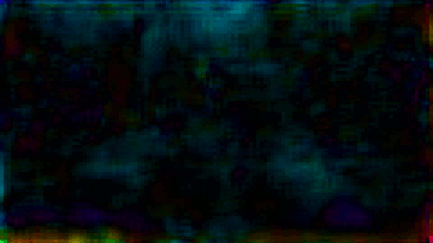
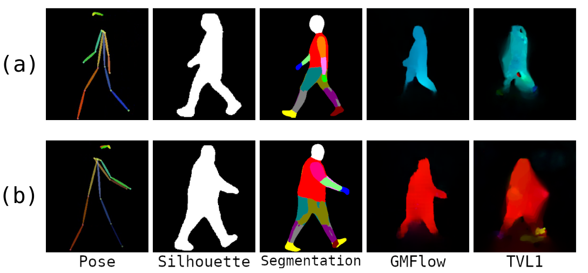

# Health&Gait: a video dataset for gait-based analysis

<p align="center">
    
    
    
    
    
    <br>
    <sup>The differents data modalities contains in the dataset. From left to right shows pose, semantic segmentation, silhouette and optical flow.</sup>
</p>


## Description
This repository contains the **Health&Gait** dataset, the first that enables gait analysis using visual information without specific sensors, relying solely on cameras. The dataset includes multimodal features extracted from videos and gait parameters and anthropometric measurement from each participant. The dataset is intended for use in health, sports and gait analysis research.

<p align="center">
    
    <br>
    <sup>Two examples of the different data types from the dataset for two participants (a) and (b).</sup>
</p>

## Dataset Contents
_Describe what the dataset contains. For example, the number of samples, the features included, the format of the data, etc._

Health&Gait consists of 1,564 videos of 398 participants walking in a controlled closed environment, where each video has associated the following information:

- 2D pose estimation of their joints by [**AlphaPose**](https://github.com/MVIG-SJTU/AlphaPose) (JSON format files).
- Semantic segmentation by [**DensePose**](https://github.com/facebookresearch/detectron2/tree/main/projects/DensePose) (PNG images).
- Optical flow by [**TVL1**](https://docs.opencv.org/3.4/dc/d47/classcv_1_1DualTVL1OpticalFlow.html) and [**GMFlow**](https://github.com/haofeixu/gmflow) (PNG images).
- Silhouette by [**YOLOV8**](https://github.com/ultralytics/ultralytics) (JPEG images).

Moreover, for each participants the following data has been recorded:

- Anthropometric measurements.
- Gait parameters obtained from OptoGait and MuscleLAB.
- Gait parameters estimated from pose information. 

<p align="center">
    
    <br>
    <sup>Directory and file scheme of the Health&Gait database.</sup>
</p>

<details><summary> <b>Attributes in the file participants_measures.csv</b> </summary>

<center>

| Attributes          | Description                                                  | Unit                                       |
|---------------------|--------------------------------------------------------------|--------------------------------------------|
| Sex                 | Participant sex                                              | 0:female, 1:male                           |
| Age                 | Participant Age                                              | Years                                      |
| PA\_level           | Level of physical activity                                   | >=$3$ days: Active, < $3$ days: Non active |
| Height              | Participant height                                           | cm                                         |
| Weight              | Participant weight                                           | kg                                         |
| BMI                 | Body Mass Index                                              | kg/m$^2$                                   |
| WaistC              | Waist circumference                                          | cm                                         |
| HipC                | Hip circumference                                            | cm                                         |
| NeckC               | Neck circumference                                           | cm                                         |
| Percentage fat mass | The total mass of fat divided by total body mass             | \%                                         |
| Lean mass           | The difference between total body weight and body fat weight | kg                                         |

</center>

</details>

<details><summary> <b>Atributes in the file gait_parameters_estimation.csv.</b> </summary>

<center>

| **Attributes**               | **Description**                                                                                      | **Unit**     |
|------------------------------|------------------------------------------------------------------------------------------------------|--------------|
| Step_UGS / Step_FGS          | The distance between the two toes or heels of the feet in sequence for usual/fast gait speed.       | cm           |
| Stride_UGS / Stride_FGS      | The distance between the two toes or heels of sequential strides of the same foot for usual/fast gait speed. | cm           |
| Cadence_UGS / Cadence_FGS    | The number of steps taken per unit of time for usual/fast gait speed.                                | Steps / min  |
| MonoSP_UGS / MonoSP_FGS      | Time in the swing phase where only one limb is in contact with the ground for usual/fast gait speed. | sec          |
| BiSP_UGS / BiSP_FGS          | Time that both feet are on the ground for usual/fast gait speed.                                     | sec          |
| Speed_UGS / Speed_FGS        | Participant velocity for usual/fast gait speed.                                                      | m / s        |


</center>

</details>

## Getting Started
_Instructions on how to download and use the dataset. If the dataset is large, consider providing a script to download it._

The dataset will be accesible under request upon acceptance of the paper. _INDICATE HOW TO APPLY_


The first is to create a python environment from the **requirement.txt** file. The use of [**conda**](https://docs.anaconda.com/free/miniconda/miniconda-install/) is recommended.


```
conda create --name <env> --file requirement.txt
conda activate <env>
```

## Usage
_Provide examples of how to load and use the dataset in common programming languages or software._

## License
_Provide information about the license of the dataset._

## Citation
```bibtex
@misc{zafra2024,
  author = {Your Name},
  title = {Health&Gait: a video dataset for gait-based analysis},
  year = {2024},
  publisher = {Under Review},
  journal = {GitHub repository},
  howpublished = {\url{https://github.com/AVAuco/healthgait}}
}
```

## Contact
If you have any question or suggestion, contact us by **jzafra@uco.es**.